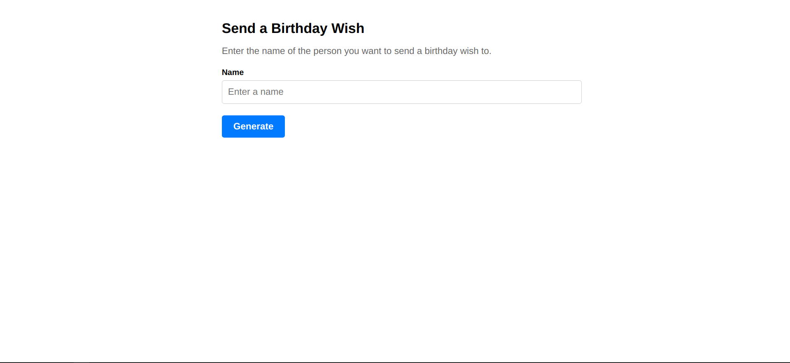
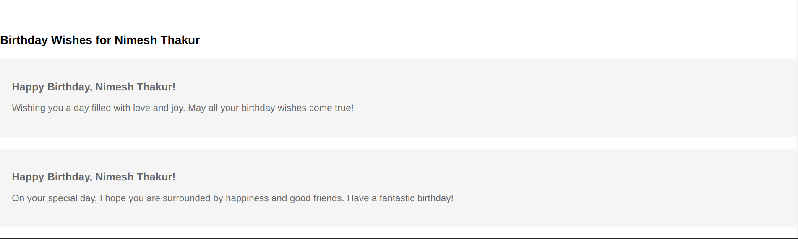

# Birthday Wish Cards

## Overview

The Birthday Wish Cards project is a React-based web application designed to create personalized birthday cards. Utilizing the power of React, Recoil for state management, and Vite for an optimized development experience, this project allows users to input a name and generate customized birthday wishes.

## Features

- **Customizable Birthday Cards**: Users can enter a name to create a personalized birthday wish.
- **Recoil State Management**: Utilizes Recoil for efficient state management across components.
- **Fast Development Experience**: Built with Vite, enabling Hot Module Replacement (HMR) for rapid development cycles.
- **Responsive Design**: Ensures a great user experience across various devices and screen sizes.

## Getting Started

### Prerequisites

- Node.js installed on your system.
- Basic knowledge of React and JavaScript.

### Installation

1. Clone the repository:

```bash
git clone https://github.com/nimeshthakur0/birthday-wish-cards.git
```

2. Navigate to the project directory:

```bash
cd birthday-wish-cards
```

3. Install the dependencies:

```bash
npm install
```

### Running the Application

- To start the development server:

```bash
npm run dev
```

- To build the project for production:

```bash
npm run build
```

- To preview the production build:

```bash
npm run preview
```

## Technologies Used

- **React**: For building the user interface.
- **Recoil**: For state management.
- **Vite**: As the build tool and development server.
- **ESLint**: For code linting.

## Screenshots





## Contributing

Contributions are welcome! Please feel free to submit a pull request or open an issue for any improvements or suggestions.

## License

This project is open source and available under the [MIT License](LICENSE).
